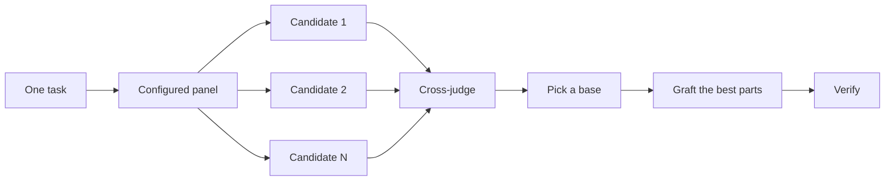

# arena、swarm 与 figure-it-out

同一件难事只试一次，会把第一份形状锁死。`/arena` 对同一份简报做几次尝试，再把最好的部分并进去。`/swarm` 在覆盖或竞速上并行，然后交回一份报告。它不做底稿选择和嫁接。`/figure-it-out` 在没有更窄的现成剧本能套上时，先为这一次设计可审计的流程。{{src:docs/guide/04-design.md}} {{src:README.md}} {{src:skills/figure-it-out/SKILL.md}}

指南给设计工作的阶梯是这些。大多数改动这些都不用。一小处已经做完、你没有把握的改动，只需要 `/interrogate`。越过函数边界或移动归属的改动，用 `/architect`，它会带上 `/arena`。独立尝试有帮助的单独决定，例如命名、格式或算法，直接用 `/arena`。覆盖矩阵、一组并行检查，或事先声明了分支的竞速，用 `/swarm`。有争议、反悔代价高的设计，先 `/architect`，交付前再 `/interrogate`。`/poteto-mode` 已经按这个阶梯做。越过边界的工作会自己触发 `/architect`。直接点名这些技能，主要是你想要比默认更多或更少的审视。{{src:docs/guide/04-design.md}} 没有现成剧本能套上时，走本章的 `figure-it-out`。{{src:README.md}}

## arena {#skill-arena}

原文：{{src:skills/arena/SKILL.md}} {{src:docs/guide/04-design.md}} {{src:README.md}}

> 对同一件事并行做 N 次尝试，通读每一份，选最强的做底稿，再把其余份里最好的想法嫁接进去并核对。

### 何时使用

触发说法是 `/arena`、 “arena this”、 “throw it in the arena”，以及非平凡产物若只试一次就会锁死错误形状的时候。README 写的是：你想对同一件事做 N 次并行尝试，然后取每一份里最好的部分。

指南写明，它是底下的通用工具。N 个子代理并行尝试同一份设计或代码简报，各自写到自己的工作树或目录。一个只读裁判在配置允许时用不同的模型族，按量规给每个候选打分。协调者通读每一份，选出底稿，把输家最好的想法嫁接进去，并核对结果。决定要紧时可以要更多候选，不要紧时要更少。{{src:docs/guide/04-design.md}}

前置信息写着 `name: arena` 与 `disable-model-invocation: true`。技能正文没有解释后一项。

### 运作方式

把同一件事扇出成 N 次并行尝试。每一份候选都从头读到尾。选最强的做底稿。把其他份里最好的想法嫁接进去。核对综合后的结果。原文把选中的那份叫做 base。

开始前打开待办，每个阶段一条，并且在派出任何东西之前打开。条目是 `Frame`、`Fan out`、`Cross-judge`、`Pick`、`Graft`、`Verify`。

指南用这张图概括同一条流程。{{src:docs/guide/04-design.md}}



**Phase A. 框定。** N 个候选会收到同一条提示，所以提示就是契约。

1. 说明每个候选要产出的产物。
2. 推导量规。先说明对这一次任务，成功是什么样，再把它变成 3 到 6 条可以打分的具体标准。量规是 Phase D 里挑选者的工具。候选只看见任务。
3. 选跑者。用 `~/.cursor/rules/pstack-models.mdc` 里的 `arena runners` 那一行。规则或那一行缺失时，默认各派一个 `claude-opus-5-5-max`、`gpt-5.6-sol-max`、`grok-4.7-xhigh-fast`。这一行或交叉裁判那一行里的 `auto` 或 `inherit-parent`，表示父级模型，于是省略 `model`。Task 拒绝某个配置好的条目时，那个席位改用它所属模型族的默认，并说明。模型族按前缀：`claude-*`、`gpt-*`、`grok-*`。没有对上的族，用 `claude-opus-5-5-max`。默认也被拒绝时，从错误信息里取同一族里最接近的有效 slug。当 arena 覆盖多个设计方向时，再多派。工作受生成限制、而不是受判断敏感限制时，同一个模型用 N 次。
4. 分配输出路径。每个候选写到自己的位置。能用 Git 工作树就用工作树，否则用 `/tmp/arena-<slug>/candidate-<n>/`。这是 [`principle-separate-before-serializing-shared-state`](principles.md#skill-principle-separate-before-serializing-shared-state)。

面板来自 [`/setup-pstack`](setup.md#skill-setup-pstack)，并且可以按这次任务调整。{{src:docs/guide/04-design.md}}

**Phase B. 扇出。** 在同一条消息里派出全部 N 个子代理，`run_in_background: true`。每个带上任务、共享落地材料的路径、它自己的输出路径，以及指示：既产出产物，也写一段短的理由。

每段理由点名这个候选考虑过的替代，以及它拒绝了什么。

某个候选没有产出时，用 N-1 继续，并在综合记录里记下这次退出。

**Phase C. 交叉裁判。** Phase B 的候选全部完成之后，从 `pstack-models.mdc` 的 `arena cross-judge pool` 那一行里选一个模型。规则或那一行缺失时，从 `claude-opus-5-5-max`、`gpt-5.6-sol-max`、`grok-4.7-xhigh-fast` 里选。优先选一个和父级不同的模型族。在那个模型上派一个只读的裁判子代理。它看见量规，以及按路径标签标识的候选。它按每条标准打分，并推荐一个底稿，附上理由。它和父级在 Phase D 里的阅读并行，不和候选本身并行。候选还在写的时候，不要派裁判。

**Phase D. 选底稿。** 挑选之前，每一份候选都从头读到尾。

按量规一条标准一条标准地打分，不要按整体感觉。和交叉裁判比较。在底稿上一致，就确认了这次挑选。不一致，意味着你们其中一个有偏向，或者量规含糊。决定之前读两边的理由。

按哪一份候选让未来的维护者最容易扩展、又不打破不变量，来选底稿。两者感觉打平时，优先更干净的边界或更小的 API。这是 Laziness Protocol，见 [`principle-laziness-protocol`](principles.md#skill-principle-laziness-protocol)。

把挑选和理由记在底稿旁边的一段短综合笔记里，包括交叉裁判的裁决。

**Phase E. 嫁接。** 再把每一份落选的候选走一遍，找出值得移植进底稿的东西。信号通常是每个候选一两处，不是其中的大部分。

每一处嫁接手写折进去。这是 [`principle-redesign-from-first-principles`](principles.md#skill-principle-redesign-from-first-principles)。不要机械粘贴。结果必须在一个心智模型下仍然连贯。

记下嫁接了什么、来自哪个候选，以及拒绝了什么、为什么。

N 个候选收敛到同一形状时，这是强的一致信号。在记录里注明这次收敛，并交上共识形状。不需要嫁接。N 个候选剧烈发散时，Phase A 规定得不够。重新框定再跑，不要把发散平均掉。

**Phase F. 核对。** 综合后的产物必须经得起和其他产出一样的审视。这是 [`principle-prove-it-works`](principles.md#skill-principle-prove-it-works)。

核对若露出 arena 没抓住的问题，要么 Phase A 错了，那就重新框定再跑。要么某个候选抓住了、你漏了嫁接，那就回到 Phase E。不要粉饰。

产出是一份综合后的产物，旁边一段短的综合笔记。笔记点名底稿、嫁接（带来源候选）、拒绝、若有的退出，以及核对结果。

### 使用例

下面两条来自原文，不是本书自拟。第一条在 README 和指南里。第二条在指南里，把候选数说成 5，因为缓存键的格式以后改起来贵。

```text
/arena take my prompt to the arena verbatim. i want to compare their proposals with yours.
```

```text
/arena this, 5 candidates. the cache key format is expensive to change later.
```

第一条要求把提示原样带进 arena，并和协调者自己的方案比较。候选看见的是任务，不是量规。第二条在 Phase A 就把 N 定成 5。各自写到自己的工作树或 `/tmp/arena-<slug>/candidate-<n>/`。全部完成之后才派只读裁判。

> **示例（本书作者所写，原文中没有）**
>
> `/arena` 给这个缓存键想三种结构上不同的格式。每份写到自己的目录。选一份底稿，只嫁接别人真正更好的那一两处。

代理在 Phase A 写出产物和 3 到 6 条可打分的标准。候选只看见任务。综合笔记记下底稿、嫁接、拒绝和核对结果。

### 陷阱与注意

候选只看见任务。量规是挑选者的工具。

候选还在写时不要派裁判。裁判是只读的，并且优先用和父级不同的模型族。

挑选之前通读每一份。按标准打分，不按整体感觉。和裁判不一致时，先读两边的理由。要么有偏向，要么量规含糊。

嫁接是每个落选候选一两处，手写折进，使结果仍在一个心智模型下连贯。不要机械粘贴。收敛到同一形状时注明共识，不再嫁接。剧烈发散时重新框定，不要平均。

某个候选没有产出，用 N-1 继续，并记在综合记录里。核对露出漏网的问题时，回到 Phase A 或 Phase E。不要粉饰。

`/swarm` 覆盖切片或按事先声明的规则竞速。它不用这里的底稿选择和嫁接。同一份设计或代码简报、然后选底稿，才是 `/arena`。{{src:docs/guide/04-design.md}}

### 相关技能

- [`architect`](architect.md#skill-architect)。设计草图用本技能，跑者行换成 `architect runners`。
- [`swarm`](#skill-swarm)。并行的是切片或竞速，不是同一份简报上的选拔。
- [`interrogate`](interrogate.md#skill-interrogate)。指南里，有争议、反悔代价高的设计在 `/architect` 之后、交付前用它来拆。它不是本技能的裁判。{{src:docs/guide/04-design.md}}
- [`figure-it-out`](#skill-figure-it-out)。单向门上的设计决定会跑 `architect`，因而跑到这里。已经定了的设计再跑第二次 arena，是过度工程。
- [二十三条原则](principles.md)。本技能点名 separate-before-serializing-shared-state、laziness-protocol、redesign-from-first-principles、prove-it-works。
- [`poteto-mode`](poteto-mode.md#skill-poteto-mode)。README 写明，模式在步骤需要时调用 `arena`。
- [工作剧本](playbooks-work.md)。模式先匹配剧本，再在步骤里调用这里。
- [`/setup-pstack`](setup.md#skill-setup-pstack)。`arena runners` 与 `arena cross-judge pool` 覆盖默认模型。
- [`tdd`](tdd-blast.md#skill-tdd)。README 写明，模式在步骤需要时也会跑 `tdd`。修缺陷且有便宜的本地测试路径时，先写失败的测试再写修复。本技能的 Phase F 核对的是综合产物，正文没有调用 `/tdd`。{{src:README.md}}

## swarm {#skill-swarm}

原文：{{src:skills/swarm/SKILL.md}} {{src:docs/guide/04-design.md}} {{src:README.md}}

> 并行派出 N 个云工作者，分片、竞速或两者混合，父级等待后交回一份汇总报告。

### 何时使用

触发说法是 `/swarm`、 “swarm this”，以及并行覆盖、竞速、gauntlet 和探索。README 写的是：你想要 N 个并行工作者，分布在不同切片或竞速上，然后要一份汇总报告。

指南写明，在并行能买到覆盖、或让互相独立的检查去竞速时用它。每个工作者有自己的范围和检查，然后报告 `PASS`、`ISSUES` 或 `BLOCKED`。父级等它们，交回一份紧凑的报告，带上缺口或退出。{{src:docs/guide/04-design.md}}

前置信息写着 `name: swarm` 与 `disable-model-invocation: true`。技能正文没有解释后一项。

### 运作方式

扇出 N 个并行的云工作者。他们可以覆盖各自的切片，可以在同一份简报上竞速，也可以混合。父级等待、汇总，交回一份报告。

开始前打开待办，每个阶段一条，并且在派出任何东西之前打开。条目是 `Frame`、`Fan out`、`Aggregate`、`Report`。

**Phase A. 框定。**

1. 说明完成谓词，以及 swarm 必须交回的产物或报告。
2. 选择形状。切成切片，让 N 个工作者在相同的简报上竞速，或两者混合。竞速或混合形状，在派出之前声明 `first pass`、`rank all` 或 `best-of`。
3. N 来自用户，或从形状推导。N 是工作者总数，不是云上的并发上限。
4. 工作者模型取 `~/.cursor/rules/pstack-models.mdc` 的 `swarm workers` 那一行。规则或那一行缺失时，用 `grok-4.7-xhigh-fast`。`auto` 或 `inherit-parent` 时省略 `model`，工作者跑在父级模型上。Task 拒绝某个 slug 时，用默认值并说明。默认也被拒绝时，从错误信息里取同一模型族里最接近的有效 slug。模型竞速时，每一支的模型事先点名。
5. 工作者会写东西时，各自有自己的可写输出。工作者要核对或测量提交时，每份简报点名确切的 SHA。测量简报还点名方法：样本数、一个样本是什么、顺序。工作者在结果里把两者都记下来。

**Phase B. 扇出。** 在同一条消息里派出全部 N 个工作者。`subagent_type` 为 `generalPurpose`，`environment` 为 `"cloud"`，`run_in_background` 为 `true`，模型用第 4 步的那个。`auto` 或 `inherit-parent` 时不设模型。只有工作者需要用户电脑上的东西时，才用 `environment: "local"`。

工作者必须从一个非默认的、已经推送的分支开始时，传 `cloud_base_branch`。

每份简报独立成立。写上目标、范围、确切的切片或竞速分支、怎样核对、报告什么。报告用 `PASS`、`ISSUES` 或 `BLOCKED`，并带证据。能证明一处缺陷的工作者报告 `ISSUES`，并列出它能证明的每一个问题，不只是第一个。

某个工作者退出时，用 N-1 继续，并记下来。

**Phase C. 汇总。** 读终端结果。一份结果若没有记下简报所点名的 SHA 和方法，就丢掉它，并把那个工作者重跑一次。第二次仍缺，记一个缺口。缺口不算通过。覆盖时，每一个必需的切片都要有结果。竞速时，应用事先声明的选择规则，用 `first pass`、`rank all` 或 `best-of`。不要粘贴工作者的原始倾倒。

留一张紧凑的结果表、一行一条且带证据的问题，以及明确的缺口或退出。

**Phase D. 报告。** 在聊天里交回一份汇总报告。带上表、问题的一行摘要、缺口或退出，以及用了竞速规则时的那条规则。

### 使用例

下面这条来自 README 和指南，不是本书自拟。每个包一个工作者，最后一份报告。

```text
/swarm check every package under packages/ against its check.sh. one worker per package. one report.
```

这是切片，不是竞速。N 等于包的个数。每份简报独立，点名那个包和它的 `check.sh`。报告是 `PASS`、`ISSUES` 或 `BLOCKED`。能证明的问题全部列出。父级交回一张表，不粘贴原始输出。

> **示例（本书作者所写，原文中没有）**
>
> `/swarm` 用三个云工作者竞速同一条迁移。事先声明 `best-of`。每份简报写上要测量的 SHA、样本数，以及一个样本是什么。

这是竞速。选择规则在派出前声明。结果若没记下 SHA 和方法，重跑一次。第二次仍缺就是缺口，不算通过。

### 陷阱与注意

N 是工作者总数，不是云并发上限。默认环境是 `"cloud"`。只有需要用户电脑上的东西时才用 `"local"`。非默认的已推送分支要传 `cloud_base_branch`。

竞速或混合必须在派出前声明 `first pass`、`rank all` 或 `best-of`。不要在汇总时再挑规则。

能证明缺陷时报告 `ISSUES`，并列出每一个能证明的问题。退出用 N-1 继续，并记下来。

没记下简报所点名的 SHA 和方法的结果要丢掉，重跑一次。第二次仍缺是缺口。缺口不算通过。覆盖时每个必需切片都要有结果。不要粘贴原始倾倒。

同一份设计或代码简报、然后选底稿并嫁接，是 [`arena`](#skill-arena)。本技能不做那套仪式。{{src:docs/guide/04-design.md}}

### 相关技能

- [`arena`](#skill-arena)。同一份简报上的多次尝试、底稿和嫁接。
- [`architect`](architect.md#skill-architect)。定形状时用它，它内部跑的是 arena，不是 swarm。
- [`figure-it-out`](#skill-figure-it-out)。只在接缝上并行，每个工作者自己的工作树或分支。
- [`poteto-mode`](poteto-mode.md#skill-poteto-mode)。README 写明，模式在步骤需要时调用 `swarm`。覆盖矩阵、竞速、gauntlet 和探索分区走这里。
- [工作剧本](playbooks-work.md)。模式先匹配剧本。并行覆盖落在步骤里时调用本技能。
- [`/setup-pstack`](setup.md#skill-setup-pstack)。`swarm workers` 是每个工作者的默认模型。竞速可以为每一支另行点名。
- [`interrogate`](interrogate.md#skill-interrogate)。多个模型试图拆掉一份 diff。那是评审，不是本技能的分片。

## figure-it-out {#skill-figure-it-out}

原文：{{src:skills/figure-it-out/SKILL.md}} {{src:README.md}}

> 没有更窄的现成剧本能套上时，先设计这一次可审计的流程，再写代码。

### 何时使用

触发说法是 `/figure-it-out`、 “figure it out”、一次大迁移，或没有更窄的剧本适用的时候。README 写的是：打包好的剧本没有一份合用。它为这次任务设计一份严格、可审计的剧本。

大规模迁移、分成许多部分的宏大改动，或人走开之后才回来审查的工作，都在这里。交付物在任何代码之前，就是流程本身。一系列阶段，严格程度随任务缩放，跑科学方法，并留下一个人走开之后仍能审计的决定轨迹。

前置信息写着 `name: figure-it-out` 与 `disable-model-invocation: true`。技能正文没有解释后一项。

### 运作方式

没有剧本匹配时，设计一份。打开待办。第一项是读完 [`poteto-mode`](poteto-mode.md#skill-poteto-mode) 的 Principles 一节。然后把下面的阶段加进待办。

**Phase A. 框定。** 先落地，再承诺。在你能说出下面这些之前，不要开始这次运行。

- 完成的定义是一个可以证伪的谓词。这是 [`principle-prove-it-works`](principles.md#skill-principle-prove-it-works)。
- 范围要量化。粗略的单位和工作量，加上落地时露出的阻塞。
- 严格程度偏向高。单向的门和影响面大的，给更多。可逆、利害低的步骤，给更少。严格程度是门禁和产物。原文写明它不是 “try harder”。

在承诺一次长运行之前，先摆出框定和取舍。可逆的工作继续做。这是 [`principle-never-block-on-the-human`](principles.md#skill-principle-never-block-on-the-human)。一次要跑很多小时的运行，赢得一个检查点。

**Phase B. 设计流程。** 分解成原子的、可以独立落地的单位。最未知的风险排在前面。脚手架和核对先于功能。这是 [`principle-foundational-thinking`](principles.md#skill-principle-foundational-thinking)。

- 工作之前先建核对装置。基线从改动前的状态捕获，使检查读成 “旧值对上新值”。
- 单向门上的设计决定，运行 [`architect`](architect.md#skill-architect)。它会跑 [`arena`](#skill-arena)。形状已经具体的机械工作，跳过它。在已经定了的设计上再跑第二次 arena，是过度工程。这是 [`principle-laziness-protocol`](principles.md#skill-principle-laziness-protocol)。
- 决定什么要扇出。只在接缝上并行。每个工作者自己的工作树或分支。这是 [`principle-separate-before-serializing-shared-state`](principles.md#skill-principle-separate-before-serializing-shared-state)。不要过度扇出。
- 把设计好的阶段列表写下来。那份列表就是人要审查的东西。

然后执行这份设计。把它的步骤作为具体条目加进待办，放在 Phase C 那条之后、Phase D 那条之前。每一步都在 Phase C 的循环纪律下跑。Phase D 的日志织在其中，每一步落地就写一行，不要把整条轨迹留到最后。

**Phase C. 跑循环。** 每个单位是一次实验。陈述假设，做最小的改动，在真实产物上对照谓词测量。推进了就保留。没有推进就回退。应用 [`principle-sequence-verifiable-units`](principles.md#skill-principle-sequence-verifiable-units)。每个单位在开始下一个之前核对，不要把检查攒到最后。

- 靠检查产物来核对，绝不靠自我报告。某件事太容易就通过时，先怀疑观察方法，再怀疑系统。
- 派出的工作要配一个裁判。工作者若在钻门禁的空子，就重置并收紧契约。门禁本身错了，就在它自己的一次改动里修门禁，不要绕开它。
- 裁决是 `VERIFIED`、`NOT VERIFIED` 或 `INCONCLUSIVE`。不确定不是通过。不要把负面藏起来。

**Phase D. 留下审计轨迹。** 经 [`show-me-your-work`](personal.md#skill-show-me-your-work) 记录这次运行。本技能的工作通常大到值得把轨迹提交，让审查者在 PR 里读到它。轨迹加上 diff，才让人回来之后能信任这项工作。

**Phase E. 核对并交回。** 对照 Phase A 的谓词检查整体，在真实产品上，不只在核对装置上。把反复出现的纠正编码成一道门、一条 lint、一次检查或一段脚本。这是 [`principle-encode-lessons-in-structure`](principles.md#skill-principle-encode-lessons-in-structure)。

回复这些东西。你设计的剧本、严格程度以及为什么、决定轨迹的路径、对照谓词已经核对了什么、什么仍然开放。

### 使用例

下面这条来自 README，不是本书自拟。人要走开。把每个调用方从同步存储迁到新的异步存储，行为保持相同。回来时要能信任它做对了。

```text
/poteto-mode i'm stepping away. migrate every caller from the synchronous store to the new async one, keeping behavior identical. i want to trust it was done right when i'm back.
```

这是一次大迁移，而且人离开后才审查。即使较窄的剧本也能套上一部分，没有更窄的一份能覆盖 “回来时能信任” 这个要求时，就设计这一次的流程。完成谓词要可以证伪，例如行为保持相同并且每个调用方都已迁完。核对装置在改动前捕获基线。单向的设计决定走 `architect`。轨迹提交，使人能在 PR 里读到。

> **示例（本书作者所写，原文中没有）**
>
> `/figure-it-out` 把仓库里三处互相独立的配置加载收成一处。每处都可以单独落地。我离开两小时，回来要看谓词和轨迹。

范围可以量化成三处。它们互相独立，所以可以在接缝上并行，各自一个分支。两小时的运行按 Phase A 还不到 “很多小时才赢得一个检查点” 的那种长运行。可逆的准备可以继续。回复仍要给出设计的剧本、严格程度、轨迹路径、已核对的部分和仍开放的部分。

> **解说（本书的解释，原文中没有）**
>
> 上面把 “两小时” 读成还没到技能所说的 multi-hour。技能只写 “a multi-hour run earns one checkpoint”，没有写小时数的界限。真要走开、并且希望回来能审计时，仍然可以给一个检查点。这是本书的判断，不是正文里的阈值。

### 陷阱与注意

代码之前的交付物是流程本身。阶段列表写下来给人审。

完成定义必须是可以证伪的谓词。严格程度是门禁和产物，随单向的门和影响面升降。长运行在承诺前先摆出框定和取舍。可逆工作继续。很多小时的运行有一个检查点。

核对装置在工作之前建好，基线来自改动前。检查读成旧值对新值。每个单位先核对再开始下一个。通过得太容易时先怀疑观察方法。不确定不是通过。负面不要藏。自我报告不算核对。整体在真实产品上对照 Phase A 的谓词，不只在装置上。

机械工作、形状已经具体时，不要为了仪式再跑 `architect`。已经定了的设计上的第二次 arena 是过度工程。只在接缝上并行。每个工作者自己的工作树或分支。

工作者钻门禁的空子时，重置并收紧契约。门禁错了，在它自己的改动里修，不要绕开。

轨迹通常要提交。每一步落地就写一行，不要留到最后。反复出现的纠正编码成门、lint、检查或脚本。

> **解说（本书的解释，原文中没有）**
>
> 技能写 high blast radius 时，说的是这次运行该上多重的门禁。README 里另有 [`/blast-radius`](tdd-blast.md#skill-blast-radius)，用来看一小处改动还可能碰坏什么，并且要求那个 “因此才安全” 的事实来自跑过的代码。两处用了相近的词。`figure-it-out` 的正文没有把 `/blast-radius` 写成自己的一步。{{src:README.md}}

### 相关技能

- [`poteto-mode`](poteto-mode.md#skill-poteto-mode)。待办的第一项是读它的 Principles。没有更窄的剧本时，模式会落到这里。
- [工作剧本](playbooks-work.md)。有更窄的剧本合用时，走模式匹配到的那一份。
- [`architect`](architect.md#skill-architect) 与 [`arena`](#skill-arena)。只用于单向门上的设计决定。
- [`swarm`](#skill-swarm)。扇出只发生在接缝上，并给每个工作者自己的工作树或分支。
- [`show-me-your-work`](personal.md#skill-show-me-your-work)。Phase D 的轨迹。
- [二十三条原则](principles.md)。本技能点名 prove-it-works、never-block-on-the-human、foundational-thinking、laziness-protocol、separate-before-serializing-shared-state、sequence-verifiable-units、encode-lessons-in-structure。
- [`tdd`](tdd-blast.md#skill-tdd)。README 里，修缺陷且有便宜的本地测试路径时走它。本技能要求的是改动前的核对装置，正文没有调用 `/tdd`。
- [`interrogate`](interrogate.md#skill-interrogate)。有争议的设计在交付前由模式或 `architect` 走到它。本技能的正文没有把它写成必经步骤。
